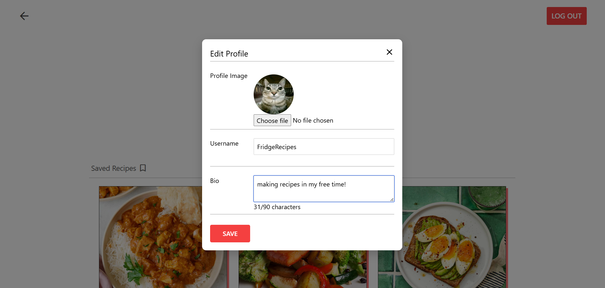

# FridgeRecipes
## About
FridgeRecipes is a web-based application designed to reduce food waste by helping users create meals with ingredients they already have at home. Each user has their own virtual fridge where they can add or remove their ingredients, in turn the web-page will show recipes whose ingredient match the most with the user ingredeints. The system allows users to:
- Add and manage fridge ingredients
- Get personalized recipe suggestions based on available ingredients
- Browse and search for recipes by category, name, or missing ingredients
- Save favorite recipes to profile

Technologies used:
 - Frontend: Vue 3, Inertia.js
 - Backend: Laravel with Laravel Breeze for authentication
 - Database: MySQL 

## How to use
 - Clone repo to xampp/htdocs/..
 - Install npm and composer
 - Install other needed packages if needed (ex. vue)
 - Run php artisan migrate
 - Run php artisan serve
 
(You need to open xampp and run apache and mesql servers, then create new db in the phpmyadmin and connect it in the env file)
